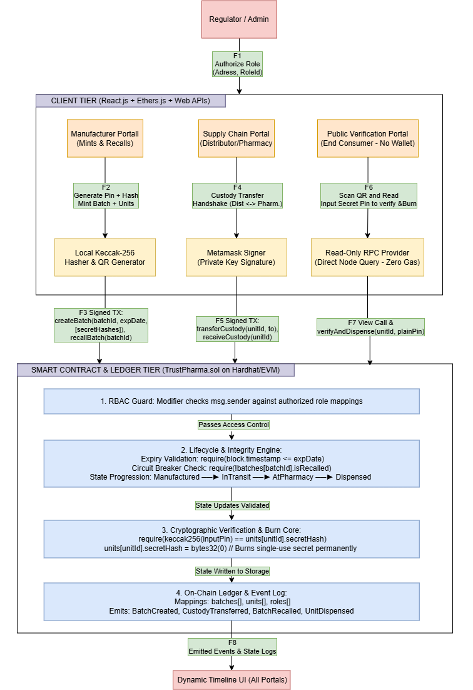

# TrustPharma: Decentralized Drug Authenticity & Anti-Counterfeit Network

TrustPharma is a Web3 supply chain verification system designed to eliminate pharmaceutical counterfeiting, supply diversion, and the distribution of expired medicines. By pairing cryptographic commit-reveal scratch-off secrets with an immutable state machine, TrustPharma guarantees single-use physical box verification and instant global recalls.

---

## Architecture Overview



The system operates across three primary layers:
1. **Client Tier:** Role-specific web dashboards (Manufacturer, Supply Chain, Consumer) built with React.js, Vite, Tailwind CSS, and Ethers.js.
2. **Blockchain & Smart Contract Tier:** EVM-based smart contract (`TrustPharma.sol`) implementing Role-Based Access Control (RBAC), sequential state transitions, automated expiry enforcement, and single-use secret burning.
3. **Cryptographic Engine:** Off-chain Keccak-256 secret generation with on-chain zero-knowledge commitment validation.

---

## Key Features & Security Mitigations

* **Counterfeit Injection Defense:** Bytecode-level `onlyManufacturer` modifier prevents unauthorized addresses from minting fake inventory.
* **Single-Use Scratch-PIN Commitment:** Packaging features a dual-layer verification (Public QR `unitId` + Secret Scratch `PIN`). Validating a PIN permanently burns `secretHash` to `bytes32(0)` on-chain, preventing package duplication.
* **Automated Expiry Locking:** EVM rejects transfer and dispensing calls if `block.timestamp > expDate`.
* **Supply Diversion Prevention:** Strict sequential custody checks ensure inventory cannot bypass registered supply chain intermediaries.
* **Emergency Global Recall:** Manufacturers can trigger a single-transaction circuit breaker (`recallBatch`) freezing all units across the globe instantly.

---

## Tech Stack

* **Smart Contracts:** Solidity (`^0.8.20`), OpenZeppelin Contracts
* **Development & Local Chain:** Hardhat, Ethers.js
* **Frontend:** React.js (Vite), Tailwind CSS v4, Lucide Icons, `qrcode.react`
* **Wallet / Signer:** MetaMask (Browser Extension)

---

## Local Development Setup

### Prerequisites
* [Node.js](https://nodejs.org/) (v20+ recommended)
* [MetaMask Extension](https://metamask.io/download/) installed in your browser

---

### Step 1: Clone and Install Root Dependencies

```bash
git clone <your-repository-url>
cd trust-pharma

# Install Hardhat and OpenZeppelin contracts
npm install
```

---

### Step 2: Configure and Install Frontend Dependencies

```bash
cd frontend
npm install
cd ..
```

---

### Step 3: Run the Local Blockchain Node

In a dedicated terminal window:

```bash
npx hardhat node
```

*This spins up a local Ethereum node at `http://127.0.0.1:8545` with 20 pre-funded test accounts.*

---

### Step 4: Run Tests & Attack Simulation Suite

In a second terminal window:

```bash
npx hardhat test
```

---

### Step 5: Start the React Frontend

```bash
cd frontend
npm run dev
```

Open `http://localhost:5173` in your browser to interact with the dApp.

---

## Project Structure

```text
trust-pharma/
├── contracts/               # Smart contract source files
│   └── TrustPharma.sol      # Core state machine & verification logic
├── test/                    # Automated testing & attack simulations
├── scripts/                 # Deployment scripts for local & testnet
├── frontend/                # React Vite client
│   ├── src/
│   │   ├── components/      # Role-based UI portals
│   │   ├── utils/           # Web3 providers & hashing helpers
│   │   └── App.jsx
│   └── vite.config.js
├── hardhat.config.ts        # Hardhat network & compiler configuration
└── package.json             # Root dependencies manifest
```
